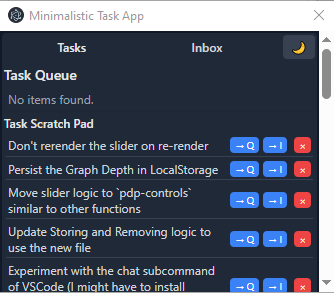

# Minimalistic Task App

A lightweight, always-on-top task management application built with Electron that helps you organize tasks.

## What is it?

This is a minimal desktop task manager that floats above other applications, designed for quick task organization and note-taking without interrupting your workflow.

## Features

- **Always on top**: Stays visible while working in other applications
- **Persistent storage**: Tasks are saved to JSON files in `C:/Users/[username]/coding/task-queue/`
- **Dark/Light mode**: Toggle between themes with the moon button
- **Compact design**: Minimalistic floating window

## How it works

The application organizes tasks into two main areas:

### 📥 **Task Inbox**
- Collection area for tasks that must be processed
- Add tasks quickly using the input field

### 📝 **Task Scratch Pad**
- Quick notes, ideas, and temporary thoughts  
- Perfect for jotting down ideas that come up while working on something
